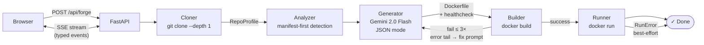

# DockerForge

> An agentic pipeline that clones any public GitHub repository, analyses its
> codebase, and generates + builds a working Dockerfile — self-correcting on
> failure with a Gemini-powered retry loop.

Watch the demo = https://www.youtube.com/watch?v=6rcZmW_oSo0

DockerForge doesn't just ask an LLM to "write a Dockerfile." It runs a closed
agent loop: **clone → analyse → generate → build → (reason & retry ×3) → run →
verify**, streaming every step to the UI in real time over SSE.

---

## Architecture



### Repository layout

```
dockerforge/
├── backend/                       # Python 3.11 + FastAPI
│   ├── app/
│   │   ├── main.py                # App factory, CORS
│   │   ├── config.py              # Typed settings (pydantic-settings)
│   │   ├── api/routes.py          # /api/forge, /api/health, SSE stream
│   │   ├── agent/
│   │   │   ├── cloner.py          # SSRF-guarded git clone, size cap
│   │   │   ├── analyzer.py        # Manifest-first language/framework detection
│   │   │   ├── generator.py       # Gemini structured-output Dockerfile generation
│   │   │   ├── builder.py         # docker build with streaming logs + retry
│   │   │   ├── runner.py          # docker run + 4 health-check modes
│   │   │   └── orchestrator.py    # Pipeline state machine, job store wiring
│   │   └── models/                # Pydantic schemas (RepoProfile, GeneratorOutput …)
│   ├── tests/                     # 130 tests, zero external deps
│   └── requirements.txt
├── frontend/                      # React 19 + Vite + Tailwind v4
│   ├── src/App.jsx                # useForge hook, Timeline / LogPanel / DockerfileCard
│   ├── nginx.conf                 # SPA fallback + /api proxy (prod)
│   └── Dockerfile                 # Multi-stage: node build → nginx serve
├── backend/Dockerfile             # python:3.11-slim + docker CLI + non-root user
├── docker-compose.yml             # Socket-mount stack; DinD tradeoff documented
└── .env.example
```

---

## Quick start — local dev

**Prerequisites:** Python 3.11+, Node 20+, Docker Desktop, a
[Gemini API key](https://aistudio.google.com/apikey).

```bash
# 1. Secrets
cp .env.example .env              # fill in GEMINI_API_KEY

# 2. Backend
cd backend
python3 -m venv .venv && source .venv/bin/activate
pip install -r requirements.txt
uvicorn app.main:app --reload --port 8000
# → http://localhost:8000/api/health

# 3. Frontend (new terminal)
cd frontend
npm install
npm run dev
# → http://localhost:5173
```

---

## Quick start — Docker stack

```bash
cp .env.example .env              # fill in GEMINI_API_KEY
# Match the docker group GID on your host (usually 999):
export DOCKER_GID=$(getent group docker | cut -d: -f3)
docker compose up --build
# → http://localhost:3000
```

The backend container mounts `/var/run/docker.sock` so `docker build` calls
go to the **host** daemon — no Docker-in-Docker needed.
See [docker-compose.yml](docker-compose.yml) for the socket-mount vs DinD
tradeoff discussion.

---

## Environment variables

| Variable | Default | Description |
|---|---|---|
| `GEMINI_API_KEY` | — | **Required.** Google Gemini API key. |
| `GEMINI_MODEL` | `gemini-2.0-flash` | Gemini model name. |
| `CORS_ORIGINS` | `http://localhost:5173` | Comma-separated allowed origins. |
| `CLONE_TIMEOUT_SECONDS` | `60` | Max seconds for `git clone`. |
| `MAX_REPO_MB` | `200` | Reject repos larger than this after cloning. |
| `BUILD_TIMEOUT_SECONDS` | `600` | Max seconds for `docker build`. |
| `RUN_TIMEOUT_SECONDS` | `60` | Max seconds for health-check verification. |
| `MAX_BUILD_ATTEMPTS` | `3` | Max generate + build attempts before giving up. |
| `CONTAINER_MEMORY` | `256m` | `--memory` limit on every spawned container. |
| `CONTAINER_CPUS` | `0.5` | `--cpus` limit on every spawned container. |
| `DOCKER_GID` | `999` | Docker group GID for socket access (compose stack only). |

---

## API reference

| Method | Path | Description |
|---|---|---|
| `POST` | `/api/forge` | Start a forge job. Body: `{"repo_url": "https://github.com/..."}` |
| `GET` | `/api/forge/{job_id}` | Poll job status + event count. |
| `GET` | `/api/forge/{job_id}/stream` | SSE stream of typed events (supports `Last-Event-ID`). |
| `GET` | `/api/health` | Liveness probe. |

### SSE event types

| Type | Key fields |
|---|---|
| `step_started` | `step` (`clone` \| `analyze` \| `generate` \| `build` \| `run`) |
| `attempt` | `number`, `max` |
| `log_line` | `line` (one `docker build` output line) |
| `build_result` | `success`, `attempt`, `image_tag` / `error_tail` |
| `run_result` | `success`, `message`, `error` |
| `done` | `dockerfile`, `image_tag`, `attempts`, `run_success`, `reasoning` |
| `error` | `message`, optionally `attempt_history` |

Each message carries a numeric `id:` field; clients reconnecting with
`Last-Event-ID` resume from where they left off.

---

## Why Gemini?

- **Structured output (JSON mode)** — `response_schema=GeneratorOutput` enforces
  the Pydantic schema server-side; no regex scraping of Dockerfile text from prose.
- **1 M-token context window** — large repos' key files fit without chunking.
- **Generous free tier** — usable in demos without billing setup.
- `gemini-2.0-flash` hits the right speed/quality tradeoff for an iterative
  retry loop where three round-trips may happen in a single request.

*(Claude Code was the pair-programmer that built this project; Gemini is the
model that runs inside the shipped product — separate concerns.)*

---

## Security posture

Cloned repositories are **untrusted code**. DockerForge applies several layers
of defence:

| Threat | Mitigation |
|---|---|
| SSRF via repo URL | URL validated locally before any network call: `https://github.com` only, no ports, regex-checked `owner/repo` path. |
| Oversized repos | Size-checked after clone; aborted if `> MAX_REPO_MB`. |
| Runaway builds | `BUILD_TIMEOUT_SECONDS` hard deadline; process killed on expiry. |
| Runaway containers | `--memory` + `--cpus` flags on every `docker run`. |
| Host path exposure | Host filesystem is never mounted into spawned containers. |
| Non-root processes | Backend runs as `appuser` (UID 1001); generated containers advised to do the same. |
| Docker socket access | Socket-mount grants daemon access — mitigated by SSRF guard and resource limits. DinD tradeoff documented in `docker-compose.yml`. |

---

## Known limitations

- **Single-process job store** — in-memory `dict`; restart clears all jobs.
  Replace with Redis + Celery for multi-worker deployments.
- **Docker daemon required** — won't run on serverless free tiers without socket
  forwarding. Works on any Linux/macOS host with Docker Desktop.
- **`--no-cache` on every build** — deterministic but slow; layers are never
  reused across attempts.
- **Public repos only** — no OAuth flow for private repos.
- **Apple Silicon (arm64)** — images built and run on the same host arch;
  cross-compilation not attempted.

---

## Test coverage

```
130 tests, 0 external dependencies

  test_cloner.py        18  URL validation, SSRF guards (private IPs, non-GitHub hosts)
  test_analyzer.py      27  Manifest-first detection across Python, Node, static, unknown
  test_generator.py     17  Gemini JSON-mode output, fallback parsing, prompt content
  test_builder.py       14  Subprocess streaming, timeout, Docker-not-running detection
  test_orchestrator.py  20  Pipeline state machine, retry logic, RunError best-effort
  test_runner.py        14  4 verification modes, resource-limit flags, cleanup guarantee
  test_routes.py        14  HTTP routes, SSE format, Last-Event-ID resume
  test_integration.py    6  End-to-end: HTTP POST → real analyzer → mock LLM+Docker → SSE
```

Run with:

```bash
cd backend
source .venv/bin/activate
pytest tests/ -v
```

---

*Built by [Satyam Maddheshiya](https://github.com/satyamsipah). This README
describes only what the code actually does.*
